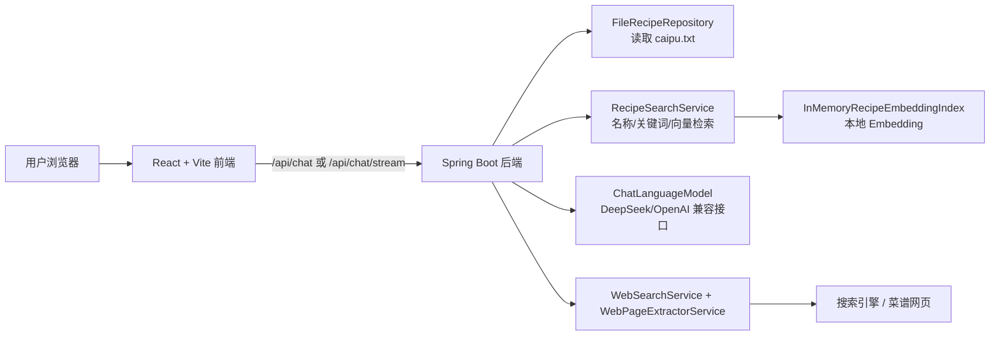
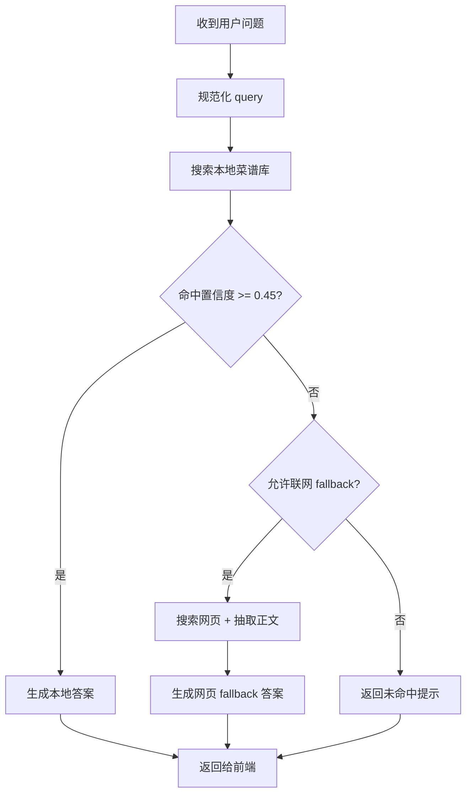

# Recipe Agent

一个面向中文菜谱问答场景的示例项目：

- 后端使用 `Spring Boot 3 + LangChain4j`
- 前端使用 `React + Vite`
- 本地菜谱库来自根目录的 `caipu.txt`
- 查询时优先命中本地菜谱；本地命中不可靠时，再尝试联网搜索网页菜谱

这份 README 按“第一次接手项目的人也能跑起来”的标准来写，包含开发、配置、构建、部署和排障说明。

## 1. 项目能做什么

用户在前端输入一句话，例如：

- `宫保鸡丁怎么做？`
- `鱼香肉丝的步骤是什么？`
- `麻婆豆腐要放什么调料？`

系统的处理逻辑是：

1. 后端先把问题规范化成适合检索的菜名/意图。
2. 在本地 `caipu.txt` 菜谱库里做名称、关键词和向量混合检索。
3. 如果命中可信，直接返回本地菜谱答案。
4. 如果本地命中不足，再尝试联网搜索公开网页并抽取正文。
5. 如果配置了大模型 API Key，会优先走 AI 工具调用链；没有 Key 时仍然可以走确定性本地渲染逻辑。

## 2. 技术栈

### 后端

- Java `17`
- Maven
- Spring Boot `3.3.5`
- LangChain4j `0.36.2`
- Jsoup
- 本地向量模型：`AllMiniLmL6V2EmbeddingModel`

### 前端

- Node.js
- React `18`
- TypeScript
- Vite `5`

## 3. 目录结构

```text
.
├── README.md
├── caipu.txt                        # 本地菜谱数据，JSON 数组格式
├── pom.xml                          # 后端 Maven 配置
├── src/main/java/com/webcrawler/recipe/app
│   ├── RecipeApplication.java       # Spring Boot 启动入口
│   ├── config/                      # AI 模型配置
│   ├── controller/                  # HTTP 接口
│   ├── repository/                  # 本地菜谱加载
│   └── service/                     # 检索、渲染、联网 fallback
├── src/main/resources
│   └── application.properties       # 后端配置
└── chat-ui
    ├── package.json                 # 前端依赖与脚本
    ├── vite.config.ts               # 本地开发代理到 8091
    └── src/
        ├── App.tsx                  # 聊天页面
        └── api.ts                   # 调用 /api/chat 与 /api/chat/stream
```

## 4. 架构图

### 4.1 运行架构



### 4.2 请求处理流程



## 5. 开发前准备

请先确认本机安装了下面这些工具：

- JDK `17`
- Maven `3.9+`
- Node.js `18+`
- npm `9+`

可以用下面的命令检查：

```bash
java -version
mvn -version
node -v
npm -v
```

## 6. 配置说明

后端配置文件在 `src/main/resources/application.properties`。

当前关键配置如下：

| 配置项 | 作用 | 默认值 |
| --- | --- | --- |
| `server.port` | 后端端口 | `8091` |
| `recipe.data.path` | 菜谱数据文件路径 | `caipu.txt` |
| `langchain4j.open-ai.base-url` | OpenAI 兼容接口地址 | `https://api.deepseek.com` |
| `langchain4j.open-ai.model` | 对话模型名 | `deepseek-chat` |
| `langchain4j.open-ai.api-key` | 模型 API Key | 从 `OPENAI_API_KEY` 或 `DEEPSEEK_API_KEY` 读取 |
| `recipe.web.enabled` | 是否启用联网 fallback | `true` |
| `recipe.web.timeout-ms` | 联网超时 | `8000` |
| `recipe.web.max-results` | 最多处理的搜索结果数 | `5` |

### 6.1 API Key 怎么配

推荐用环境变量，不要把 Key 写死到仓库里。

macOS / Linux:

```bash
export DEEPSEEK_API_KEY=你的密钥
```

如果你用的是 OpenAI 兼容网关，也可以：

```bash
export OPENAI_API_KEY=你的密钥
```

### 6.2 没有 API Key 能不能跑

可以。

- 本地菜谱检索和确定性答案渲染仍然可用
- AI 工具链不会启用
- 联网 fallback 的网页抓取仍可运行，但回答质量会退化到规则渲染版本

对于第一次本地联调，建议先不配 Key，把基础流程跑通；确认后端和前端都正常，再补模型能力。

## 7. 本地开发启动

推荐开两个终端窗口：一个跑后端，一个跑前端。

### 7.1 启动后端

在仓库根目录执行：

```bash
mvn spring-boot:run
```

启动成功后，后端监听：

```text
http://localhost:8091
```

健康检查：

```bash
curl http://localhost:8091/api/health
```

预期返回：

```json
{"status":"ok"}
```

### 7.2 启动前端

在另一个终端执行：

```bash
cd chat-ui
npm install
npm run dev
```

默认前端地址：

```text
http://localhost:5173
```

前端开发服务器已经在 `chat-ui/vite.config.ts` 里配置了代理：

- 浏览器请求 `/api`
- Vite 自动转发到 `http://localhost:8091`

所以本地开发时，不需要改前端接口地址。

### 7.3 本地联调顺序

第一次启动建议按这个顺序检查：

1. 先启动后端，确认 `GET /api/health` 正常。
2. 再启动前端，打开 `http://localhost:5173`。
3. 输入 `宫保鸡丁怎么做？`
4. 如果页面能流式返回文本，说明基础链路已经通了。

## 8. 常用接口

后端所有接口都挂在 `/api` 下。

| 方法 | 路径 | 说明 |
| --- | --- | --- |
| `POST` | `/api/chat` | 普通聊天接口 |
| `POST` | `/api/chat/stream` | 流式聊天接口，返回 `application/x-ndjson` |
| `POST` | `/api/recipes/ask` | 直接问菜谱 |
| `GET` | `/api/recipes` | 列出菜谱，可带 `q` 和 `limit` |
| `GET` | `/api/recipes/{id}` | 查看单个菜谱 |
| `GET` | `/api/health` | 健康检查 |

### 8.1 测试聊天接口

```bash
curl -X POST http://localhost:8091/api/chat \
  -H 'Content-Type: application/json' \
  -d '{
    "sessionId": null,
    "message": "宫保鸡丁怎么做？"
  }'
```

### 8.2 测试流式接口

```bash
curl -N -X POST http://localhost:8091/api/chat/stream \
  -H 'Content-Type: application/json' \
  -d '{
    "sessionId": null,
    "message": "鱼香肉丝怎么做？"
  }'
```

## 9. 构建产物

### 9.1 构建后端

在仓库根目录执行：

```bash
mvn clean package
```

产物通常在：

```text
target/recipe-agent-0.0.1-SNAPSHOT.jar
```

运行方式：

```bash
java -jar target/recipe-agent-0.0.1-SNAPSHOT.jar
```

### 9.2 构建前端

```bash
cd chat-ui
npm install
npm run build
```

产物在：

```text
chat-ui/dist/
```

## 10. 部署说明

这个项目当前更适合下面这种部署方式：

- Spring Boot 独立跑后端
- Nginx 托管 `chat-ui/dist`
- Nginx 把 `/api` 反向代理到 Spring Boot

原因很简单：前端代码里调用的是相对路径 `/api`，因此生产环境最好保持“前后端同域，同一个入口”。

### 10.1 最小可用部署方案

#### 步骤 1：构建前后端

```bash
mvn clean package
cd chat-ui
npm install
npm run build
```

#### 步骤 2：启动后端

部署机上需要准备：

- JDK 17
- `caipu.txt`
- 模型 API Key（可选）

示例：

```bash
export DEEPSEEK_API_KEY=你的密钥
java -jar target/recipe-agent-0.0.1-SNAPSHOT.jar
```

如果部署目录和仓库根目录不同，记得显式指定菜谱文件路径：

```bash
java -jar target/recipe-agent-0.0.1-SNAPSHOT.jar \
  --recipe.data.path=/absolute/path/to/caipu.txt
```

这是必要的，因为默认值 `caipu.txt` 是相对路径。

#### 步骤 3：Nginx 托管前端并代理后端

参考配置：

```nginx
server {
    listen 80;
    server_name your-domain.com;

    root /path/to/xiachufang/chat-ui/dist;
    index index.html;

    location / {
        try_files $uri $uri/ /index.html;
    }

    location /api/ {
        proxy_pass http://127.0.0.1:8091;
        proxy_http_version 1.1;
        proxy_set_header Host $host;
        proxy_set_header X-Real-IP $remote_addr;
        proxy_set_header X-Forwarded-For $proxy_add_x_forwarded_for;
        proxy_set_header X-Forwarded-Proto $scheme;
        proxy_buffering off;
    }
}
```

其中 `proxy_buffering off;` 对流式接口更友好，避免前端迟迟收不到分片。

### 10.2 systemd 后端托管示例

如果你的服务器用的是 Linux + systemd，可以参考：

```ini
[Unit]
Description=Recipe Agent
After=network.target

[Service]
User=www-data
WorkingDirectory=/srv/xiachufang
Environment=DEEPSEEK_API_KEY=your-key
ExecStart=/usr/bin/java -jar /srv/xiachufang/target/recipe-agent-0.0.1-SNAPSHOT.jar --recipe.data.path=/srv/xiachufang/caipu.txt
Restart=always
RestartSec=5

[Install]
WantedBy=multi-user.target
```

## 11. 新手最容易踩的坑

### 11.1 后端启动失败：找不到 `caipu.txt`

现象：启动时报数据文件不存在。

原因：`recipe.data.path=caipu.txt` 是相对路径，默认相对于当前工作目录解析。

解决：

- 在仓库根目录启动
- 或者用绝对路径传入 `--recipe.data.path=/absolute/path/to/caipu.txt`

### 11.2 前端页面打开了，但请求失败

优先检查这三件事：

1. 后端是否已经启动在 `8091`
2. 前端是否通过 `npm run dev` 启动，而不是直接双击本地 HTML
3. 浏览器里请求是否发到了 `/api/...`

### 11.3 没配 API Key，为什么还能返回结果

这是预期行为。项目支持“无模型降级”：

- 有本地菜谱命中时，直接走规则渲染
- 只是回答不会像大模型那样自然

### 11.4 生产环境前端 404 或接口 404

通常是 Nginx 没配好：

- 前端路由需要 `try_files ... /index.html`
- 后端接口需要把 `/api/` 代理到 `8091`

### 11.5 流式接口在生产环境不流式

通常是反向代理缓冲导致的。先检查：

- 是否代理到了 `/api/chat/stream`
- 是否关闭了代理缓冲
- 是否有额外网关/CDN 把响应缓存或聚合了

## 12. 后续开发建议

如果你准备继续迭代这个项目，建议优先做这几件事：

1. 给 `src/test` 增加后端单元测试和接口测试。
2. 给前端补“后端未启动 / 接口超时 / 空结果”的更明确提示。
3. 把部署方式收敛成 `Dockerfile + docker-compose`，降低新环境接入成本。
4. 把模型配置拆到环境变量或部署配置中心，避免任何敏感信息进入仓库。

## 13. 一句话启动清单

只想快速跑通，可以直接照这个顺序执行：

```bash
# 终端 1：后端
cd /path/to/xiachufang
mvn spring-boot:run

# 终端 2：前端
cd /path/to/xiachufang/chat-ui
npm install
npm run dev
```

然后打开：

```text
http://localhost:5173
```
