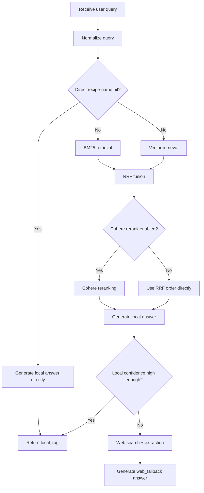
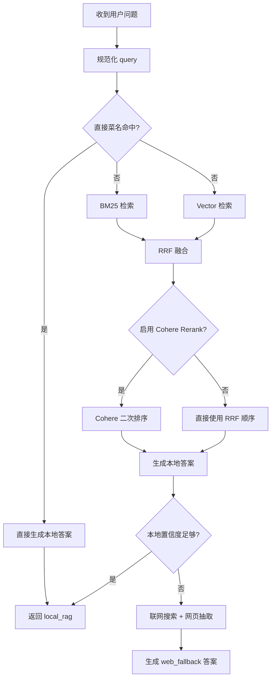

# Recipe Agent / 菜谱问答助手

This README is bilingual.  
English comes first, followed by the Chinese version.  
本文档为中英双语版本。  
前半部分是英文，后半部分是中文。

---

## English

### 1. Overview

This is a sample project for Chinese recipe question answering.

- Backend: `Spring Boot 3 + LangChain4j`
- Frontend: `React + Vite`
- Data source: `caipu.txt` in the repo root
- Retrieval pipeline: `BM25 + Vector -> RRF -> Cohere Rerank`
- Fallback pipeline: web search + page extraction when local confidence is not sufficient

The system currently supports three main paths:

1. Local RAG QA
2. Web fallback QA
3. Streaming chat with LangChain4j `AiServices` and tools

---

### 2. Current Architecture

#### 2.1 Retrieval and Answering Flow



#### 2.2 Prompt Strategy

The answer prompts now use a compact `CRISPE` structure:

- `RecipePromptBuilder` for local RAG answers
- `WebRecipePromptBuilder` for web fallback answers

Goals:

- answer with the conclusion first
- stay grounded in the provided context
- explicitly say when information is missing
- reduce boilerplate and unsupported elaboration

#### 2.3 Chunking Strategy

Chunking has been redesigned from “splitting steps into tiny fragments and stitching them back” into a structure-aware multi-view chunking strategy.

Each recipe now produces:

- `summary`
- `ingredients_full`
- `ingredients_terms`
- `steps_window`
- `notes_technique`
- `recipe_parent_light`

Design intent:

- `summary`: high-level recipe facts such as category, difficulty, servings, time, tags
- `ingredients_full`: preserves original ingredient expressions
- `ingredients_terms`: normalized ingredient terms, mainly for BM25
- `steps_window`: slices original steps into windows, currently `3` steps with `1` step overlap
- `notes_technique`: notes and technique-focused content derived from explicit notes and step text
- `recipe_parent_light`: lightweight parent chunk for full-recipe level recall and context recovery

This is better suited for structured recipe documents because it respects:

- ingredient boundaries
- original step numbering
- note / technique boundaries
- full-recipe level summaries

#### 2.4 Unified Metadata

All chunks now share one unified metadata structure:
[RecipeChunkMetadata.java](/Users/zefengqiu/Documents/xiachufang/src/main/java/com/webcrawler/recipe/app/model/recipe/RecipeChunkMetadata.java:1)

Core fields:

- `chunkId`
- `parentChunkId`
- `dishId`
- `dishName`
- `view`
- `chunkOrder`
- `category`
- `difficulty`
- `tags`
- `servings`
- `prepTimeMinutes`
- `cookTimeMinutes`
- `totalTimeMinutes`
- `stepStart`
- `stepEnd`
- `stepRange`

This gives the system:

- a consistent structure for BM25 / vector / rerank
- consistent logging and candidate merging
- easier future extension of chunk types

---

### 3. Tech Stack

#### Backend

- Java `17`
- Maven
- Spring Boot `3.3.5`
- LangChain4j `0.36.2`
- `langchain4j-open-ai`
- `langchain4j-cohere`
- Jsoup
- Local embedding model: `AllMiniLmL6V2EmbeddingModel`

#### Frontend

- Node.js `18+`
- React `18`
- TypeScript
- Vite `5`

---

### 4. Project Layout

```text
.
├── README.md
├── caipu.txt
├── pom.xml
├── src/main/java/com/webcrawler/recipe/app
│   ├── config/
│   ├── controller/
│   ├── model/
│   ├── retriever/
│   ├── service/
│   ├── tool/
│   └── util/
├── src/main/resources
│   └── application.properties
└── chat-ui
```

---

### 5. Local Development

Requirements:

- JDK `17`
- Maven `3.9+`
- Node.js `18+`
- npm `9+`

Check:

```bash
java -version
mvn -version
node -v
npm -v
```

#### 5.1 Start the Backend

```bash
mvn spring-boot:run
```

Default backend URL:

```text
http://localhost:8091
```

Health check:

```bash
curl http://localhost:8091/api/health
```

#### 5.2 Start the Frontend

```bash
cd chat-ui
npm install
npm run dev
```

Default frontend URL:

```text
http://localhost:5173
```

---

### 6. Configuration

The config file is:
[src/main/resources/application.properties](/Users/zefengqiu/Documents/xiachufang/src/main/resources/application.properties:1)

#### 6.1 Important Settings

| Key | Purpose | Default |
| --- | --- | --- |
| `server.port` | backend port | `8091` |
| `recipe.data.path` | recipe data path | `caipu.txt` |
| `recipe.web.enabled` | enable web fallback | `true` |
| `recipe.web.timeout-ms` | web request timeout | `8000` |
| `recipe.web.max-results` | max search results | `5` |
| `recipe.debug.rag` | enable debug logging | `true` |
| `recipe.rerank.enabled` | enable Cohere rerank | `false` |
| `recipe.rerank.top-n` | max rerank candidates | `10` |
| `recipe.rerank.cohere.base-url` | Cohere API base URL | `https://api.cohere.com` |
| `recipe.rerank.cohere.model` | Cohere rerank model | `rerank-multilingual-v3.0` |
| `recipe.rerank.cohere.timeout` | rerank timeout | `PT20S` |
| `recipe.rerank.cohere.max-retries` | rerank retries | `2` |
| `recipe.rerank.cohere.api-key` | Cohere API key | empty |
| `langchain4j.open-ai.base-url` | OpenAI-compatible base URL | `https://api.deepseek.com` |
| `langchain4j.open-ai.model` | chat model | `deepseek-chat` |
| `langchain4j.open-ai.api-key` | chat model API key | empty |

#### 6.2 Recommended Environment Variables

```bash
export DEEPSEEK_API_KEY=your-key
export COHERE_API_KEY=your-key
```

Recommended property usage:

```properties
langchain4j.open-ai.api-key=${DEEPSEEK_API_KEY:}
recipe.rerank.cohere.api-key=${COHERE_API_KEY:}
```

#### 6.3 Enable Cohere Rerank

```properties
recipe.rerank.enabled=true
recipe.rerank.cohere.api-key=${COHERE_API_KEY:}
recipe.rerank.cohere.model=rerank-multilingual-v3.0
```

---

### 7. API Endpoints

| Method | Path | Description |
| --- | --- | --- |
| `POST` | `/api/chat/stream` | streaming chat, prefers the AI tools path |
| `POST` | `/api/recipes/ask` | local recipe QA / web fallback QA |
| `GET` | `/api/recipes` | recipe list, supports `q` and `limit` |
| `GET` | `/api/recipes/{id}` | recipe detail |
| `GET` | `/api/health` | health check |

Example local QA request:

```bash
curl -X POST http://localhost:8091/api/recipes/ask \
  -H 'Content-Type: application/json' \
  -d '{
    "sessionId": null,
    "query": "How should I marinate the meat for fish-fragrant shredded pork?"
  }'
```

---

### 8. Debug Logging

With `recipe.debug.rag=true`, the system emits these logs.

#### 8.1 Local Retrieval

- `RAG-QUERY`
- `RAG-DIRECT`
- `RAG-RETRIEVE`
- `RAG-SELECT`
- `RAG-PROMPT`

#### 8.2 RRF

- `RRF-BM25`
- `RRF-VECTOR`
- `RRF-FUSED`

To validate the new chunking strategy, check whether:

- full-recipe queries surface `summary / recipe_parent_light`
- ingredient queries surface `ingredients_full / ingredients_terms`
- step-level queries surface `steps_window`
- technique queries surface `notes_technique`

#### 8.3 Cohere Rerank

- `RERANK-SKIP`
- `RERANK-SCORE`
- `RERANK-ORDER`

The simplest way to see rerank contribution is to compare:

1. `RRF-FUSED`
2. `RERANK-ORDER`

---

### 9. Build and Deploy

#### 9.1 Backend

```bash
mvn clean package
java -jar target/recipe-agent-0.0.1-SNAPSHOT.jar
```

#### 9.2 Frontend

```bash
cd chat-ui
npm install
npm run build
```

#### 9.3 Minimal Deployment Example

```bash
export DEEPSEEK_API_KEY=your-key
export COHERE_API_KEY=your-key

java -jar target/recipe-agent-0.0.1-SNAPSHOT.jar \
  --recipe.data.path=/absolute/path/to/caipu.txt \
  --recipe.rerank.enabled=true
```

Use Nginx to serve `chat-ui/dist` and proxy `/api` to port `8091`.
Disable proxy buffering for streaming endpoints.

---

### 10. Common Issues

#### 10.1 `caipu.txt` Not Found

Start the app from the repo root, or pass:

```bash
--recipe.data.path=/absolute/path/to/caipu.txt
```

#### 10.2 `CohereScoringModel` Import Fails

Make sure the dependency exists:

```xml
<dependency>
    <groupId>dev.langchain4j</groupId>
    <artifactId>langchain4j-cohere</artifactId>
    <version>${langchain4j.version}</version>
</dependency>
```

Then run:

```bash
mvn -q -DskipTests compile
```

#### 10.3 `RRF-FUSED` Does Not Appear

If the query is resolved by `directNameHit`, hybrid retrieval is skipped.

#### 10.4 `RERANK-SCORE` Does Not Appear

Check:

```properties
recipe.rerank.enabled=true
recipe.rerank.cohere.api-key=${COHERE_API_KEY:}
recipe.debug.rag=true
```

If rerank is skipped, inspect:

- `RERANK-SKIP reason=disabled`
- `RERANK-SKIP reason=no_scoring_model`
- `RERANK-SKIP reason=empty_candidates`

---

### 11. Next Steps

1. Remove all plaintext API keys from the repo
2. Add systematic evaluation sets for `chunk -> RRF -> rerank`
3. Run A/B tests for the `CRISPE` prompts
4. Make `steps_window` size and overlap configurable
5. Add backend tests
6. Add `Dockerfile + docker-compose`

---

### 12. Quick Start

```bash
# Terminal 1: backend
cd /path/to/xiachufang
mvn spring-boot:run

# Terminal 2: frontend
cd /path/to/xiachufang/chat-ui
npm install
npm run dev
```

Open:

```text
http://localhost:5173
```

---

## 中文

### 1. 项目简介

这是一个面向中文菜谱问答场景的示例项目。

- 后端：`Spring Boot 3 + LangChain4j`
- 前端：`React + Vite`
- 数据源：根目录 `caipu.txt`
- 检索链路：`BM25 + Vector -> RRF -> Cohere Rerank`
- 兜底链路：本地命中不足时，联网搜索并抽取网页内容

当前系统支持三条主要路径：

1. 本地 RAG 问答
2. 联网 Web fallback 问答
3. 基于 LangChain4j `AiServices` 的流式工具调用聊天

---

### 2. 当前架构

#### 2.1 检索与回答流程



#### 2.2 Prompt 策略

当前回答 prompt 使用压缩版 `CRISPE` 结构：

- `RecipePromptBuilder`：本地 RAG 问答
- `WebRecipePromptBuilder`：联网 fallback 问答

目标：

- 先给结论，再补充必要说明
- 尽量只基于当前上下文
- 信息不足时明确说明
- 减少套话和无依据扩写

#### 2.3 Chunk 策略

当前 chunking 已从“把步骤拆碎后再拼接”改成结构感知的多视图 chunk。

每道菜当前会生成这些 chunk：

- `summary`
- `ingredients_full`
- `ingredients_terms`
- `steps_window`
- `notes_technique`
- `recipe_parent_light`

设计要点：

- `summary`：整道菜的简介、分类、难度、份量、时长、标签
- `ingredients_full`：保留原始食材表达
- `ingredients_terms`：归一化食材词项，主要服务 BM25
- `steps_window`：按原始步骤切窗，默认 `3` 步一块，`overlap 1` 步
- `notes_technique`：从 `additionalNotes` 和步骤里的注意事项提取技巧块
- `recipe_parent_light`：整道菜级别的轻量父块

这套设计是为了同时兼顾：

- 整道菜 query
- 食材 query
- 单步 / 顺序 / 火候 query
- 技巧 / 失败原因 query

#### 2.4 统一 Metadata

所有 chunk 共用统一 metadata 结构：
[RecipeChunkMetadata.java](/Users/zefengqiu/Documents/xiachufang/src/main/java/com/webcrawler/recipe/app/model/recipe/RecipeChunkMetadata.java:1)

核心字段：

- `chunkId`
- `parentChunkId`
- `dishId`
- `dishName`
- `view`
- `chunkOrder`
- `category`
- `difficulty`
- `tags`
- `servings`
- `prepTimeMinutes`
- `cookTimeMinutes`
- `totalTimeMinutes`
- `stepStart`
- `stepEnd`
- `stepRange`

目的：

- 统一 BM25 / vector / rerank 输入结构
- 统一日志和候选归并
- 便于后续继续扩展 chunk 类型

---

### 3. 技术栈

#### 后端

- Java `17`
- Maven
- Spring Boot `3.3.5`
- LangChain4j `0.36.2`
- `langchain4j-open-ai`
- `langchain4j-cohere`
- Jsoup
- 本地 embedding 模型：`AllMiniLmL6V2EmbeddingModel`

#### 前端

- Node.js `18+`
- React `18`
- TypeScript
- Vite `5`

---

### 4. 目录结构

```text
.
├── README.md
├── caipu.txt
├── pom.xml
├── src/main/java/com/webcrawler/recipe/app
│   ├── config/      # 模型、检索、Rerank 配置
│   ├── controller/  # /api HTTP 接口
│   ├── model/       # 请求、响应、菜谱、metadata
│   ├── retriever/   # BM25 / Vector / Hybrid / Rerank
│   ├── service/     # 本地问答、流式问答、联网 fallback
│   ├── tool/        # LangChain4j tools
│   └── util/        # 规范化、chunking、prompt builder
├── src/main/resources
│   └── application.properties
└── chat-ui
```

---

### 5. 本地开发

环境要求：

- JDK `17`
- Maven `3.9+`
- Node.js `18+`
- npm `9+`

检查命令：

```bash
java -version
mvn -version
node -v
npm -v
```

#### 5.1 启动后端

```bash
mvn spring-boot:run
```

后端默认地址：

```text
http://localhost:8091
```

健康检查：

```bash
curl http://localhost:8091/api/health
```

#### 5.2 启动前端

```bash
cd chat-ui
npm install
npm run dev
```

前端默认地址：

```text
http://localhost:5173
```

---

### 6. 配置说明

配置文件在
[src/main/resources/application.properties](/Users/zefengqiu/Documents/xiachufang/src/main/resources/application.properties:1)。

#### 6.1 关键配置

| 配置项 | 作用 | 默认值 |
| --- | --- | --- |
| `server.port` | 后端端口 | `8091` |
| `recipe.data.path` | 菜谱数据路径 | `caipu.txt` |
| `recipe.web.enabled` | 是否允许联网 fallback | `true` |
| `recipe.web.timeout-ms` | 联网请求超时 | `8000` |
| `recipe.web.max-results` | 搜索结果上限 | `5` |
| `recipe.debug.rag` | 是否打印调试日志 | `true` |
| `recipe.rerank.enabled` | 是否启用 Cohere rerank | `false` |
| `recipe.rerank.top-n` | rerank 候选上限 | `10` |
| `recipe.rerank.cohere.base-url` | Cohere API 地址 | `https://api.cohere.com` |
| `recipe.rerank.cohere.model` | Cohere 模型 | `rerank-multilingual-v3.0` |
| `recipe.rerank.cohere.timeout` | rerank 超时 | `PT20S` |
| `recipe.rerank.cohere.max-retries` | rerank 重试 | `2` |
| `recipe.rerank.cohere.api-key` | Cohere API Key | 空 |
| `langchain4j.open-ai.base-url` | OpenAI 兼容地址 | `https://api.deepseek.com` |
| `langchain4j.open-ai.model` | 对话模型 | `deepseek-chat` |
| `langchain4j.open-ai.api-key` | 对话模型 API Key | 空 |

#### 6.2 推荐的环境变量

```bash
export DEEPSEEK_API_KEY=你的密钥
export COHERE_API_KEY=你的密钥
```

推荐在配置里这样引用：

```properties
langchain4j.open-ai.api-key=${DEEPSEEK_API_KEY:}
recipe.rerank.cohere.api-key=${COHERE_API_KEY:}
```

#### 6.3 启用 Cohere rerank

```properties
recipe.rerank.enabled=true
recipe.rerank.cohere.api-key=${COHERE_API_KEY:}
recipe.rerank.cohere.model=rerank-multilingual-v3.0
```

---

### 7. 常用接口

| 方法 | 路径 | 说明 |
| --- | --- | --- |
| `POST` | `/api/chat/stream` | 流式聊天接口，优先走 AI tools 链路 |
| `POST` | `/api/recipes/ask` | 本地菜谱 / web fallback 问答 |
| `GET` | `/api/recipes` | 菜谱列表，支持 `q`、`limit` |
| `GET` | `/api/recipes/{id}` | 单个菜谱详情 |
| `GET` | `/api/health` | 健康检查 |

测试本地问答：

```bash
curl -X POST http://localhost:8091/api/recipes/ask \
  -H 'Content-Type: application/json' \
  -d '{
    "sessionId": null,
    "query": "鱼香肉丝里的肉怎么腌？"
  }'
```

---

### 8. 调试日志

当 `recipe.debug.rag=true` 时，当前会打印这些关键日志。

#### 8.1 本地检索

- `RAG-QUERY`
- `RAG-DIRECT`
- `RAG-RETRIEVE`
- `RAG-SELECT`
- `RAG-PROMPT`

#### 8.2 RRF

- `RRF-BM25`
- `RRF-VECTOR`
- `RRF-FUSED`

验证新 chunk 是否有效时，重点看：

- 整道菜 query 是否更容易命中 `summary / recipe_parent_light`
- 食材 query 是否更容易命中 `ingredients_full / ingredients_terms`
- 步骤 query 是否更容易命中 `steps_window`
- 技巧 query 是否更容易命中 `notes_technique`

#### 8.3 Cohere Rerank

- `RERANK-SKIP`
- `RERANK-SCORE`
- `RERANK-ORDER`

判断 rerank 是否有效，最直接的方法是对照：

1. `RRF-FUSED`
2. `RERANK-ORDER`

---

### 9. 构建与部署

#### 9.1 后端构建

```bash
mvn clean package
java -jar target/recipe-agent-0.0.1-SNAPSHOT.jar
```

#### 9.2 前端构建

```bash
cd chat-ui
npm install
npm run build
```

#### 9.3 最小部署示例

```bash
export DEEPSEEK_API_KEY=your-key
export COHERE_API_KEY=your-key

java -jar target/recipe-agent-0.0.1-SNAPSHOT.jar \
  --recipe.data.path=/absolute/path/to/caipu.txt \
  --recipe.rerank.enabled=true
```

使用 Nginx 托管 `chat-ui/dist` 并把 `/api` 代理到 `8091`。
对流式接口关闭代理缓冲。

---

### 10. 常见问题

#### 10.1 找不到 `caipu.txt`

请在仓库根目录启动，或显式指定：

```bash
--recipe.data.path=/absolute/path/to/caipu.txt
```

#### 10.2 `CohereScoringModel` import 失败

确认依赖已加：

```xml
<dependency>
    <groupId>dev.langchain4j</groupId>
    <artifactId>langchain4j-cohere</artifactId>
    <version>${langchain4j.version}</version>
</dependency>
```

然后执行：

```bash
mvn -q -DskipTests compile
```

#### 10.3 看不到 `RRF-FUSED`

如果 query 被 `directNameHit` 命中，就不会进入混合检索。

#### 10.4 看不到 `RERANK-SCORE`

优先检查：

```properties
recipe.rerank.enabled=true
recipe.rerank.cohere.api-key=${COHERE_API_KEY:}
recipe.debug.rag=true
```

如果 rerank 没执行，先看：

- `RERANK-SKIP reason=disabled`
- `RERANK-SKIP reason=no_scoring_model`
- `RERANK-SKIP reason=empty_candidates`

---

### 11. 后续建议

1. 把明文 API Key 全部移出仓库
2. 给 `chunk -> RRF -> rerank` 增加系统化评测样本
3. 给 `CRISPE` prompt 做 A/B 对比
4. 把 `steps_window` 的窗口大小和 overlap 做成配置项
5. 增加后端测试
6. 补 `Dockerfile + docker-compose`

---

### 12. 一句话启动

```bash
# 终端 1：后端
cd /path/to/xiachufang
mvn spring-boot:run

# 终端 2：前端
cd /path/to/xiachufang/chat-ui
npm install
npm run dev
```

打开：

```text
http://localhost:5173
```
