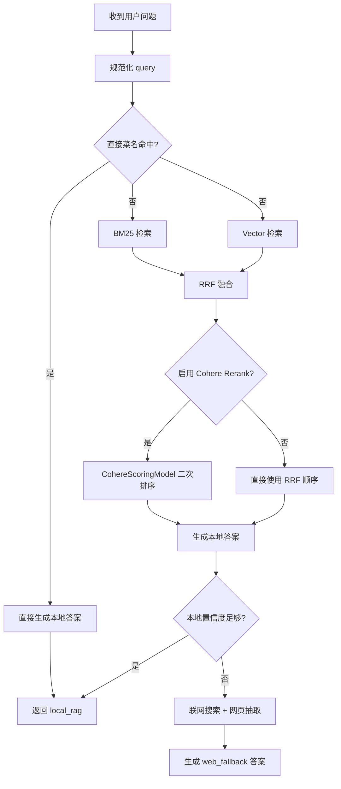

# Recipe Agent

一个面向中文菜谱问答场景的示例项目。

- 后端：`Spring Boot 3 + LangChain4j`
- 前端：`React + Vite`
- 数据源：根目录 `caipu.txt`
- 检索链路：`BM25 + Vector -> RRF -> Cohere Rerank`
- 兜底链路：本地菜谱命中不足时，联网搜索并抽取网页内容

这份 README 以“第一次接手项目的人能直接跑起来”为目标，同时补齐当前实现里的关键点：混合检索、Cohere rerank、调试日志、以及 CRISPE prompt。

## 1. 项目能力

用户可以输入这类问题：

- `宫保鸡丁怎么做？`
- `鱼香肉丝里的肉怎么腌？`
- `麻婆豆腐为什么容易出水？`
- `红烧排骨先焯水还是先炒糖色？`

系统当前有两条主要回答路径：

1. `本地 RAG`
   - 规范化 query
   - 名称直达命中
   - 否则走 `BM25 + vector` 检索
   - 用 `RRF` 融合候选
   - 可选使用 `Cohere rerank` 做二次排序
   - 最终用本地渲染器或大模型回答

2. `Web fallback`
   - 本地命中不可靠时
   - 搜索网页菜谱
   - 抽取正文、食材、步骤、技巧
   - 用规则渲染或大模型整理回答

另外，项目还支持一条 `AI tools + streaming` 聊天链路：如果配置了 `StreamingChatLanguageModel`，`/api/chat/stream` 会优先走 LangChain4j `AiServices`；否则自动回退到本地菜谱问答服务。

## 2. 技术栈

### 后端

- Java `17`
- Maven
- Spring Boot `3.3.5`
- LangChain4j `0.36.2`
- `langchain4j-open-ai`
- `langchain4j-cohere`
- Jsoup
- 本地 embedding 模型：`AllMiniLmL6V2EmbeddingModel`

### 前端

- Node.js `18+`
- React `18`
- TypeScript
- Vite `5`

## 3. 目录结构

```text
.
├── README.md
├── caipu.txt
├── pom.xml
├── src/main/java/com/webcrawler/recipe/app
│   ├── RecipeApplication.java
│   ├── config/                      # 模型、检索、Rerank Bean 配置
│   ├── controller/                  # /api HTTP 接口
│   ├── model/                       # 请求、响应、菜谱、搜索模型
│   ├── retriever/                   # BM25 / Vector / Hybrid / Rerank
│   ├── service/                     # 本地问答、流式问答、联网 fallback
│   ├── tool/                        # LangChain4j tools
│   └── util/                        # 规范化、chunking、prompt builder
├── src/main/resources
│   └── application.properties
└── chat-ui
    ├── package.json
    ├── vite.config.ts
    └── src/
```

## 4. 当前架构

### 4.1 检索与回答流程



### 4.2 Prompt 组织

项目里的回答 prompt 已改成压缩版 `CRISPE` 结构：

- `RecipePromptBuilder`: 本地 RAG 问答
- `WebRecipePromptBuilder`: 联网 fallback 问答

目标是让模型更稳定地：

- 先回答结论
- 尽量只基于当前上下文
- 信息不足时明确说明
- 少说套话，少编造成分

## 5. 开发前准备

请确认本机安装：

- JDK `17`
- Maven `3.9+`
- Node.js `18+`
- npm `9+`

检查命令：

```bash
java -version
mvn -version
node -v
npm -v
```

## 6. 配置说明

配置文件在 [src/main/resources/application.properties](/Users/zefengqiu/Documents/xiachufang/src/main/resources/application.properties:1)。

### 6.1 关键配置

| 配置项 | 作用 | 默认值 |
| --- | --- | --- |
| `server.port` | 后端端口 | `8091` |
| `recipe.data.path` | 菜谱数据路径 | `caipu.txt` |
| `recipe.web.enabled` | 是否允许联网 fallback | `true` |
| `recipe.web.timeout-ms` | 联网请求超时 | `8000` |
| `recipe.web.max-results` | 搜索结果上限 | `5` |
| `recipe.debug.rag` | 是否打印检索 / prompt / rerank 调试日志 | `true` |
| `recipe.rerank.enabled` | 是否启用 Cohere rerank | `false` |
| `recipe.rerank.top-n` | rerank 候选上限 | `10` |
| `recipe.rerank.cohere.base-url` | Cohere API 地址 | `https://api.cohere.com` |
| `recipe.rerank.cohere.model` | Cohere rerank 模型 | `rerank-multilingual-v3.0` |
| `recipe.rerank.cohere.timeout` | rerank 超时 | `PT20S` |
| `recipe.rerank.cohere.max-retries` | rerank 重试次数 | `2` |
| `recipe.rerank.cohere.api-key` | Cohere API Key | 空 |
| `langchain4j.open-ai.base-url` | OpenAI 兼容接口地址 | `https://api.deepseek.com` |
| `langchain4j.open-ai.model` | 对话模型名 | `deepseek-chat` |
| `langchain4j.open-ai.api-key` | 对话模型 API Key | 空 |

### 6.2 API Key 配置

推荐改成环境变量，不要把 Key 写进仓库。

macOS / Linux:

```bash
export DEEPSEEK_API_KEY=你的密钥
export COHERE_API_KEY=你的密钥
```

然后在 `application.properties` 里引用，或通过启动参数传入。

至少建议这样改：

```properties
langchain4j.open-ai.api-key=${DEEPSEEK_API_KEY:}
recipe.rerank.cohere.api-key=${COHERE_API_KEY:}
```

### 6.3 启用 Cohere rerank

只加依赖还不够，还需要显式打开：

```properties
recipe.rerank.enabled=true
recipe.rerank.cohere.api-key=${COHERE_API_KEY:}
recipe.rerank.cohere.model=rerank-multilingual-v3.0
```

当前代码里使用的是 `langchain4j-cohere` 的 `CohereScoringModel`。

## 7. 本地开发启动

推荐两个终端：一个后端，一个前端。

### 7.1 启动后端

仓库根目录执行：

```bash
mvn spring-boot:run
```

后端默认地址：

```text
http://localhost:8091
```

健康检查：

```bash
curl http://localhost:8091/api/health
```

预期返回：

```json
{"status":"ok"}
```

### 7.2 启动前端

```bash
cd chat-ui
npm install
npm run dev
```

前端默认地址：

```text
http://localhost:5173
```

`Vite` 已代理 `/api` 到 `8091`，本地联调不需要改接口地址。

## 8. 常用接口

| 方法 | 路径 | 说明 |
| --- | --- | --- |
| `POST` | `/api/chat/stream` | 流式聊天接口，优先走 AI tools 链路 |
| `POST` | `/api/recipes/ask` | 本地菜谱 / web fallback 问答 |
| `GET` | `/api/recipes` | 菜谱列表，支持 `q`、`limit` |
| `GET` | `/api/recipes/{id}` | 单个菜谱详情 |
| `GET` | `/api/health` | 健康检查 |

### 8.1 测试本地问答

```bash
curl -X POST http://localhost:8091/api/recipes/ask \
  -H 'Content-Type: application/json' \
  -d '{
    "sessionId": null,
    "query": "鱼香肉丝里的肉怎么腌？"
  }'
```

### 8.2 测试流式聊天

```bash
curl -N -X POST http://localhost:8091/api/chat/stream \
  -H 'Content-Type: application/json' \
  -d '{
    "sessionId": null,
    "message": "宫保鸡丁怎么做？"
  }'
```

## 9. 调试与日志

当 `recipe.debug.rag=true` 时，当前会打印这些关键日志：

### 9.1 本地检索

- `RAG-QUERY`: 原始 query 与标准化 query
- `RAG-DIRECT`: 是否命中直接菜名
- `RAG-RETRIEVE`: 进入 content retriever 后的候选
- `RAG-SELECT`: 最终选中的本地菜谱
- `RAG-PROMPT`: 本地 RAG prompt

### 9.2 RRF 融合

- `RRF-BM25`: BM25 原始排名
- `RRF-VECTOR`: Vector 原始排名
- `RRF-FUSED`: RRF 融合后的候选顺序

### 9.3 Cohere rerank

- `RERANK-SKIP`: 未执行 rerank 的原因，例如 `disabled`、`no_scoring_model`
- `RERANK-SCORE`: rerank 给每个候选打的分
- `RERANK-ORDER`: rerank 前后顺序变化

如果你想确认 rerank 是否真的有贡献，最直接的办法就是对照：

1. `RRF-FUSED` 的前几名
2. `RERANK-ORDER` 的前几名

看正确候选是否被 rerank 从后面提上来。

## 10. 构建

### 10.1 后端

```bash
mvn clean package
```

产物通常在：

```text
target/recipe-agent-0.0.1-SNAPSHOT.jar
```

运行：

```bash
java -jar target/recipe-agent-0.0.1-SNAPSHOT.jar
```

### 10.2 前端

```bash
cd chat-ui
npm install
npm run build
```

产物目录：

```text
chat-ui/dist/
```

## 11. 部署说明

当前更适合这种部署方式：

- Spring Boot 独立跑后端
- Nginx 托管 `chat-ui/dist`
- Nginx 把 `/api` 代理到 Spring Boot

### 11.1 最小可用部署步骤

1. 构建前后端

```bash
mvn clean package
cd chat-ui
npm install
npm run build
```

2. 启动后端

```bash
export DEEPSEEK_API_KEY=你的密钥
export COHERE_API_KEY=你的密钥

java -jar target/recipe-agent-0.0.1-SNAPSHOT.jar \
  --recipe.data.path=/absolute/path/to/caipu.txt \
  --recipe.rerank.enabled=true
```

3. 配置 Nginx

```nginx
server {
    listen 80;
    server_name your-domain.com;

    root /path/to/xiachufang/chat-ui/dist;
    index index.html;

    location / {
        try_files $uri $uri/ /index.html;
    }

    location /api/ {
        proxy_pass http://127.0.0.1:8091;
        proxy_http_version 1.1;
        proxy_set_header Host $host;
        proxy_set_header X-Real-IP $remote_addr;
        proxy_set_header X-Forwarded-For $proxy_add_x_forwarded_for;
        proxy_set_header X-Forwarded-Proto $scheme;
        proxy_buffering off;
    }
}
```

`proxy_buffering off;` 对 `application/x-ndjson` 流式接口更友好。

## 12. 常见问题

### 12.1 启动失败：找不到 `caipu.txt`

原因通常是 `recipe.data.path=caipu.txt` 是相对路径。

处理方式：

- 在仓库根目录启动
- 或显式传入绝对路径：

```bash
--recipe.data.path=/absolute/path/to/caipu.txt
```

### 12.2 `CohereScoringModel` import 失败

先确认：

```xml
<dependency>
    <groupId>dev.langchain4j</groupId>
    <artifactId>langchain4j-cohere</artifactId>
    <version>${langchain4j.version}</version>
</dependency>
```

然后执行：

```bash
mvn -q -DskipTests compile
```

如果终端能编过但 IDE 仍报红，通常是 Maven 没刷新，重新 `Reload/Reimport` 即可。

### 12.3 为什么看不到 `RRF-FUSED`

如果 query 先命中了 `directNameHit`，请求不会进入混合检索，自然也不会有 `RRF-FUSED`。

更适合观察 RRF 的 query 一般是：

- `适合新手的鱼香肉丝做法`
- `少油版宫保鸡丁`
- `鱼香肉丝里的肉怎么腌`

### 12.4 为什么看不到 `RERANK-SCORE`

优先检查：

```properties
recipe.rerank.enabled=true
recipe.rerank.cohere.api-key=${COHERE_API_KEY:}
recipe.debug.rag=true
```

如果 rerank 没执行，日志里会先看到：

- `RERANK-SKIP reason=disabled`
- `RERANK-SKIP reason=no_scoring_model`
- `RERANK-SKIP reason=empty_candidates`

### 12.5 前端打开了，但请求失败

优先检查：

1. 后端是否启动在 `8091`
2. 前端是否通过 `npm run dev` 启动
3. 浏览器请求是否发到了 `/api/...`

### 12.6 生产环境流式接口不流式

通常是反向代理缓冲导致：

- 检查是否代理到了 `/api/chat/stream`
- 检查 `proxy_buffering off;`
- 检查是否有额外网关或 CDN 聚合响应

## 13. 后续建议

如果继续迭代，优先建议做这些事：

1. 把明文 API Key 全部移出仓库
2. 给 `RRF + rerank` 增加更系统的评测样本
3. 给 `CRISPE` prompt 加 A/B 对比测试
4. 增加后端单元测试和接口测试
5. 补一套 `Dockerfile + docker-compose`

## 14. 一句话启动

```bash
# 终端 1：后端
cd /path/to/xiachufang
mvn spring-boot:run

# 终端 2：前端
cd /path/to/xiachufang/chat-ui
npm install
npm run dev
```

打开：

```text
http://localhost:5173
```
